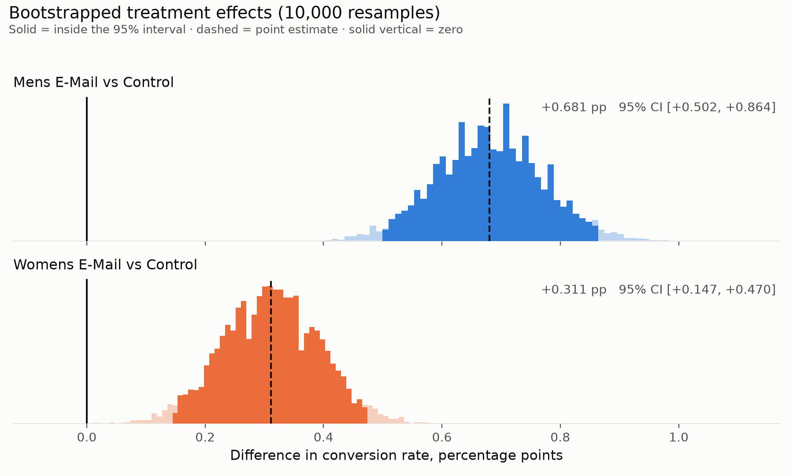
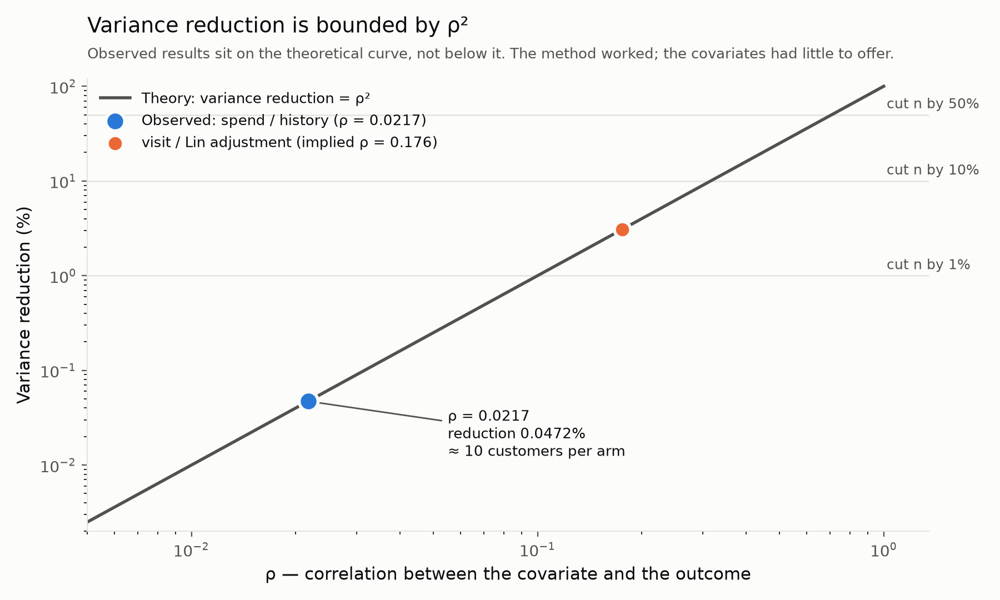
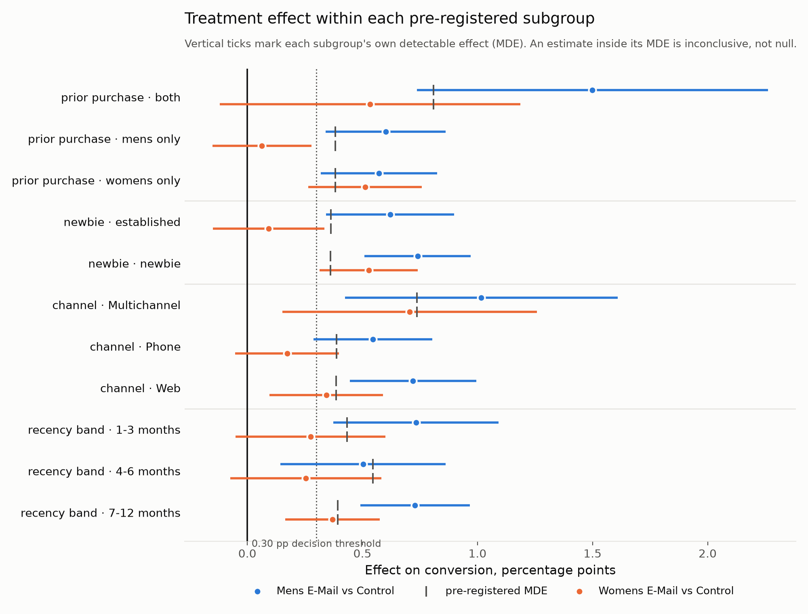

# Email Campaign Experiment Analysis

End-to-end analysis of a three-arm randomised marketing experiment: 64,000 customers
assigned to a Mens e-mail, a Womens e-mail, or no e-mail, with outcomes measured over
the following two weeks.

## The answer

**Send the Mens campaign to the entire list. The data does not support sending different
campaigns to different audiences.**

Per 100,000 customers e-mailed, the Mens campaign produces roughly **675 extra purchases**
and **$66,000–77,000 in extra revenue** against sending nothing. The Womens campaign also
beats sending nothing (~314 extra purchases), but the Mens campaign beat it in **all
eleven** customer groups examined.

A genuine heterogeneous effect *does* exist — the Womens campaign's effect depends on
prior purchase history and customer tenure, confirmed by interaction tests. It simply does
not change the decision, because there is no audience for which Womens is the better
choice.

### 📄 [**Read the one-page decision memo →**](DECISION_MEMO.md)

*Written for a marketing lead: no p-values, no jargon, and a recommendation to **not** run
the obvious follow-up test.*

---

The point of this repository is **process discipline**, not the size of the effect it
finds. The primary metric, the estimator for every metric, the subgroups, the
multiplicity correction, and the decision rule were all fixed in
[`PRE_REGISTRATION.md`](PRE_REGISTRATION.md) and committed **before any outcome was
computed by treatment arm**. The git history is the evidence.

> **Status: complete.** All eight phases are done — setup, pre-registration, data quality,
> randomisation checks, primary analysis, variance reduction, targeting, and the decision
> memo.
>
> Two amendments were added to the pre-registration during Phase 6, both after outcomes
> were observed and both disclosed as such in [§11.3](PRE_REGISTRATION.md). They are pure
> appends; the tag `pre-registration-v1` still points at the original sealed text.

---

## Analysis integrity rules

These are constraints on how this repository may be developed, not aspirations:

1. **`PRE_REGISTRATION.md` is committed and pushed before any outcome-by-arm code
   exists.** It is tagged `pre-registration-v1`. Verify with
   `git log --format='%h %ad %s' --date=iso`.
2. **History is never rewritten.** No rebase, squash, amend, or force-push after the
   pre-registration commit. A tidied history would destroy the evidence it exists to
   provide.
3. **Changes of plan are amendments**, appended as new sections in new commits. The
   original text is never edited.
4. **Pooled statistics only, before the gate.** Anything computed prior to the
   pre-registration is pooled across all three arms and therefore reveals no treatment
   contrast. See the header of [`sql/03_sanity_checks.sql`](sql/03_sanity_checks.sql).

---

## Data

[Hillstrom MineThatData E-Mail Analytics Challenge](http://www.minethatdata.com/Kevin_Hillstrom_MineThatData_E-MailAnalytics_DataMiningChallenge_2008.03.20.csv)
(2008). 64,000 customers who had purchased in the prior twelve months, randomised
roughly evenly across three arms.

| Group | Columns |
|---|---|
| Assignment | `segment` |
| Pre-treatment | `recency`, `history`, `history_segment`, `mens`, `womens`, `zip_code`, `newbie`, `channel` |
| Outcomes (2 weeks post) | `visit`, `conversion`, `spend` |

`history` is prior-year spend and `spend` is post-period spend — the same quantity
measured before and after treatment, which is what makes CUPED applicable here on real
data rather than a synthetic example.

The CSV is downloaded at build time into a gitignored `data/` directory and is not
committed.

---

## Data Quality

All checks in [`sql/03_sanity_checks.sql`](sql/03_sanity_checks.sql). Every query is
pooled across arms, so running them revealed no treatment contrast.

| Check | Result |
|---|---|
| Row count | 64,000 exactly |
| Nulls | zero, every column |
| Funnel consistency | `spend > 0 ⟹ conversion = 1 ⟹ visit = 1`, **zero violations** |
| `history` vs `history_segment` | coherent across all seven bands, no overlaps |
| Duplicate covariate vectors | 1,072 groups — **coincidence, not a defect** (below) |
| `mens = 0 AND womens = 0` | **never occurs** |
| Purchasers | 578 of 64,000 (**0.90%**) |
| Spend concentration | top 50 customers = **29.4%** of total spend |
| `spend` 99th percentile | **$0.00** |

Four of these changed the analysis plan rather than merely describing the data.

**The 99th percentile of `spend` is $0.00.** With only 0.90% of customers spending
anything, the textbook "winsorise at p99" rule is degenerate here — applying it would
cap every purchaser at zero and silently delete the metric. The pre-registered rule is
the 99.9th percentile (**$243.66**, capping 64 customers) instead. This was caught before
the pre-registration was written, which is the only reason it is a design choice rather
than a bug.

**`mens = 0 AND womens = 0` never occurs.** Every customer bought mens or womens
merchandise in the prior year, so the prior-purchase targeting variable has **three**
cells, not four: mens-only (28,818), womens-only (28,734), both (6,448). The small
"both" cell is why that subgroup carries an MDE of 0.81 pp, roughly three times the
overall test.

**The 1,072 duplicate groups are coincidence.** Exact duplicates across all twelve
columns sound alarming, so they were tested rather than assumed. A duplicated export or
a botched load copies a record *together with its assignment*, so its copies land in the
same arm. Two genuinely different customers who happen to share a covariate vector were
randomised independently, so a duplicate pair should share an arm about a third of the
time. Observed: **0.3077** across 143 pairs, against 0.3333 predicted by coincidence — and
far from the ~1.0 a duplication defect would produce. With 34,833 distinct `history`
values across 64,000 rows and 85% of customers having all-zero outcomes, collisions are
expected.

**One claim in the project brief did not survive checking.** It states that roughly 50
customers account for over half the *incremental* spend. For **total** spend the top 50
are **29.4%** — a different quantity, so that alone does not settle it.

Phase 4 settles it, and the pre-registered winsorisation is what does the work. Capping
the top 64 spenders at $243.66 shrinks the estimated spend effect from **+$0.770 to
+$0.659** for Mens (−14%) and from **+$0.424 to +$0.383** for Womens (−10%). If a
handful of customers really drove more than half the incremental spend, capping them
would have gutted the effect. It removed roughly a tenth.

The effect is therefore **more robust to the tail than the brief suggests**. Note this
came from a rule fixed before any outcome was seen — had the cap been chosen after
looking, this reassurance would be worth nothing.

---

## Randomisation Checks

Full narrative in
[`notebooks/02_randomization_checks.ipynb`](notebooks/02_randomization_checks.ipynb);
logic in [`src/balance.py`](src/balance.py).

Both checks read pre-treatment covariates and assignment counts only, so randomisation
was verified **before any treatment effect was computed** — not merely before it was
reported.

**Sample ratio mismatch: none.** χ²(2) = 0.20, **p = 0.90** against an equal three-way
split (21,307 / 21,306 / 21,387; largest deviation 54 customers, 0.25%). Had this failed,
the correct response would have been to stop and investigate the assignment mechanism —
*not* to adjust for the imbalance. Whatever corrupts assignment may equally have
corrupted the outcomes, and no covariate adjustment repairs that.

**Covariate balance: clean.** Eight pre-treatment covariates expand to 18 rows across two
contrasts — 36 comparisons. Zero exceeded |SMD| > 0.10; the largest was 0.0164.

<picture>
  <source media="(prefers-color-scheme: dark)" srcset="figures/covariate_balance-dark.png">
  
</picture>

### Reading the balance table correctly

"Zero covariates exceeded 0.10" is **not** the finding, and reporting it as one would be
misleading. For two arms of size *n*, SE(SMD) ≈ √(2/n). At n ≈ 21,300 that is **0.0097**,
so the conventional 0.10 threshold sits **10.3 standard errors** away — it could not
realistically fire regardless of how the randomiser behaved. That rule of thumb comes
from observational studies and small trials, where imbalance genuinely lives on that
scale; it does not transfer to a 64,000-person randomised experiment.

The check with actual teeth is whether the SMDs scatter like noise of the predicted size:

| | |
|---|---|
| SE(SMD) predicted by randomisation | 0.0097 |
| Observed SD of the 36 SMDs | 0.0081 (**0.84×** predicted) |
| Largest \|SMD\|, in SE units | 1.69 SE |

The slight shortfall below 1.00× is expected: one-hot levels within a categorical sum to
one, so their SMDs are negatively correlated and the 36 comparisons are not independent
draws.

Two further notes on interpretation:

- **Balance p-values are not the evidence.** Under true randomisation the null of balance
  is *known* to be true, so a balance test is not testing a hypothesis — with enough rows
  any trivial difference becomes "significant." SMDs are reported as primary for that
  reason.
- **A single imbalanced covariate would not have meant failure.** Across 36 comparisons
  roughly 1.8 nominally significant results are expected by chance (observed: 0). Reading
  one flagged row as a broken randomiser is a common error; the reasoning matters even
  though the question is moot here.

Balance being confirmed is also what licenses the covariate adjustment pre-registered in
§5: the Lin estimator is buying precision, not silently patching a compositional
difference between arms.

---

## Results

Full narrative in
[`notebooks/03_primary_analysis.ipynb`](notebooks/03_primary_analysis.ipynb); estimators
in [`src/inference.py`](src/inference.py).

These are pooled average effects — whether each campaign beats no campaign. The targeting
question (which audience gets which campaign) is a claim about effects *differing* across
subgroups, which no pooled average can settle; it is resolved in
[Targeting](#targeting--which-campaign-for-which-audience) below.

### Primary metric: conversion

Lin-adjusted OLS with HC2 robust errors, per §5. Absolute effect first, relative second —
on a 0.573% control base rate, leading with relative lift is how experiment results
mislead.

| Contrast | Effect | 95% CI | Relative | BH-adj p (q = 0.05) |
|---|---|---|---|---|
| **Mens vs Control** | **+0.675 pp** | +0.495 to +0.855 | +118% | 4.2 × 10⁻¹³ ✓ |
| **Womens vs Control** | **+0.314 pp** | +0.152 to +0.475 | +55% | 1.5 × 10⁻⁴ ✓ |

Both beat control, and both clear the pre-registered 0.30 pp decision threshold — but
that framing flatters Womens. Its point estimate clears 0.30 pp by 0.014 pp, and its
lower CI bound (0.152 pp) sits well below the threshold. The rule was written on the
point estimate, so Womens passes; the evidence that its *true* effect exceeds 0.30 pp is
considerably weaker than a pass/fail line suggests.

<picture>
  <source media="(prefers-color-scheme: dark)" srcset="figures/bootstrap_conversion-dark.png">
  
</picture>

### Sensitivity: three estimators agree

| Contrast | Lin-adjusted | Unadjusted z | Bootstrap | SE ratio adj/unadj |
|---|---|---|---|---|
| Mens vs Control | +0.6750 pp | +0.6805 pp | +0.6805 pp | 0.998 |
| Womens vs Control | +0.3135 pp | +0.3111 pp | +0.3111 pp | 1.003 |

All three land within 0.006 pp; the bootstrap and analytic intervals agree to within
0.003 pp. No discrepancy to report.

**The covariate adjustment bought essentially nothing** — SE ratios of 0.998 and 1.003.
Eight pre-treatment covariates plus treatment interactions moved the standard error by
about 0.2%, and in the wrong direction for one contrast. §5.1 had explicitly speculated
the opposite might happen:

> It is entirely possible that the pre-treatment covariates predict `conversion` better
> than `history` predicts `spend`, making the *primary* metric the larger
> variance-reduction win. Whichever way it lands is reported as found.

It landed as no. Prior-year purchase behaviour barely predicts who converts in a
two-week window, just as it barely predicts how much they spend (ρ = 0.0217). The
adjustment was still correct to pre-register — Lin (2013) guarantees it cannot hurt
asymptotically — but it did not help, and committing in advance is what makes that
reportable rather than a post-hoc rationalisation.

### Secondary: visit and spend

`visit` is a coherence check, and it is coherent: **+7.60 pp** (Mens) and **+4.55 pp**
(Womens), both ordered the same way as conversion.

`spend`, raw and winsorised at the pre-registered $243.66 (which caps exactly 64
customers):

| Contrast | Raw | Winsorised |
|---|---|---|
| Mens vs Control | +$0.770 [+0.494, +1.059] | +$0.659 [+0.440, +0.881] |
| Womens vs Control | +$0.424 [+0.168, +0.679] | +$0.383 [+0.178, +0.589] |

Winsorising shrinks both effects without overturning either.

**The decomposition is the product story.** `P(conversion) × E[spend | conversion]`:

| Contrast | P(conversion) | E[spend \| conversion] |
|---|---|---|
| Mens vs Control | 0.573% → 1.253% (**+0.68 pp**) | $114.00 → $113.53 (**−$0.47**) |
| Womens vs Control | 0.573% → 0.884% (**+0.31 pp**) | $114.00 → $121.89 (**+$7.89**) |

For the Mens campaign the entire spend effect is **more people buying** — basket size is
flat to within $0.47 on a $114 basket. The campaign acquires purchasers; it does not
change what a purchaser spends. Womens shows a +$7.89 conditional increase, but on only
189 converters and with no interval placed on it, so it is suggestive at most.

That distinction drives different follow-ups: "more people bought" points at reach and
targeting; "buyers spent more" would point at merchandising.

### Variance reduction

Implementation in [`src/variance_reduction.py`](src/variance_reduction.py). CUPED and
regression adjustment are the same idea — use pre-treatment information to remove
variance treatment cannot have caused — so §5.1 reports them as one family, each applied
to the metric it suits.

**CUPED on `spend`, with `history` as the pre-period covariate:**

| Quantity | Value |
|---|---|
| ρ(`history`, `spend`) | 0.021729 |
| ρ² — the theoretical ceiling | 0.0472% |
| θ = Cov(Y,X)/Var(X) | 0.001275 |
| Var(`spend`) before → after | 226.0948 → 225.9880 |
| **Realised reduction** | **0.0472%** |
| Theory predicted | 0.0472% |
| Gap between them | **0.000000 pp** |

The realised reduction lands on the theoretical prediction to six decimal places. This is
the point worth making: **the method worked exactly as designed — the covariate simply had
nothing to offer.** Prior-year spend and a two-week spend window are close to unrelated,
and no estimator recovers information a covariate does not contain.

§5.1 committed to this prediction *in advance* of running it, on the strength of a pooled
ρ computed before the pre-registration was written. Reporting a near-zero result that was
predicted beforehand is a different claim from discovering one afterwards.

<picture>
  <source media="(prefers-color-scheme: dark)" srcset="figures/variance_reduction-dark.png">
  
</picture>

**Unbiasedness.** The CUPED-adjusted treatment effect shifts by −$0.0025 (Mens) and
−$0.0021 (Womens) against raw effects of +$0.77 and +$0.42. That drift is not error: CUPED
also removes the portion of the raw difference attributable to *chance imbalance* in
`history`. The randomisation checks found `history` marginally higher in the Mens arm
(SMD +0.0076), and θ > 0, so the adjustment correctly shaves a little off that arm. The
drift is tiny and signed against the imbalance — what a correction looks like, not what
leakage looks like.

**Regression adjustment on the binary outcomes**, where CUPED does not apply because the
dataset contains no pre-period version of `conversion`:

| Metric | Contrast | SE ratio | Variance reduction |
|---|---|---|---|
| `conversion` | Mens vs Control | 0.9983 | +0.33% |
| `conversion` | Womens vs Control | 1.0034 | **−0.68%** |
| `visit` | Mens vs Control | 0.9844 | +3.09% |
| `visit` | Womens vs Control | 0.9874 | +2.51% |

One contrast came out *worse* adjusted than unadjusted. That is not a contradiction of
Lin (2013): the guarantee is asymptotic, and this specification spends 48 parameters on
covariates that barely predict a 0.9% event. In finite samples that costs a little
precision. It is reported as found rather than quietly dropped.

**Business translation — at a fixed MDE, how much smaller could the sample be?** Required
n scales linearly with variance, so a reduction of *r* shrinks n by exactly *r*:

| Metric | Estimator | Variance reduction | Customers saved per arm |
|---|---|---|---|
| `spend` | CUPED | 0.047% | **10** of 21,306 |
| `conversion` | Lin adjustment | 0.33% / −0.68% | 71 / **−144** |
| `visit` | Lin adjustment | 3.09% / 2.51% | 659 / 534 |

Attribution is the discipline here, per §5.1: each row is the saving for *that* metric
under *that* estimator, and none of them transfers to the primary decision unless the row
says `conversion`.

**When would CUPED actually pay?** Since reduction is ρ², the required correlation is
√(target):

| To cut n by | Needs ρ of | vs the ρ observed here |
|---|---|---|
| 1% | 0.100 | 5× |
| 10% | 0.316 | 15× |
| 50% | 0.707 | 33× |

Even a 1% saving needs roughly five times this dataset's correlation. CUPED pays when the
pre-period covariate genuinely predicts the outcome — a metric with strong user-level
persistence over a comparable window, such as sessions or revenue for retained users.
Two-week retail spend against prior-year spend is close to the worst case for it.

---

## Targeting — which campaign for which audience

Full narrative in
[`notebooks/04_targeting_analysis.ipynb`](notebooks/04_targeting_analysis.ipynb); logic
in [`src/targeting.py`](src/targeting.py).

**Answer: no differential targeting is warranted. Send the Mens campaign to everyone.**

That conclusion survives a real heterogeneous treatment effect, which makes it worth
following the reasoning rather than the headline.

### Subgroup effects, each beside its own MDE

Eleven pre-registered subgroups × two contrasts = 22 tests, BH-corrected at q = 0.10.

<picture>
  <source media="(prefers-color-scheme: dark)" srcset="figures/subgroup_effects-dark.png">
  
</picture>

The asymmetry is visible before any test: **the Mens campaign works everywhere** (all 11
effects BH-significant, +0.50 to +1.50 pp), while **the Womens campaign is selective** —
indistinguishable from zero for `mens only` buyers (+0.06 pp), `established` customers
(+0.09 pp), and `Phone` customers (+0.17 pp).

That observation is *not* evidence the effect differs. "Significant here, not there" is
the error §9.1 forbids: different cells have different standard errors, so different
verdicts arise even under an identical true effect. The test on the difference comes next.

### Interaction tests — the only valid basis for a targeting claim

| Family | Campaign | F | p | BH-adj p | |
|---|---|---|---|---|---|
| prior purchase | Womens | 3.92 | 0.0198 | **0.0792** | ✓ |
| newbie | Womens | 6.95 | 0.0084 | **0.0669** | ✓ |
| *(six others)* | | | | > 0.19 | ✗ |

**Two interactions survive, both belonging to the Womens campaign.** Its effect genuinely
depends on prior purchase history and on customer tenure. **No Mens interaction is
significant** — consistent with a campaign that simply works for everyone.

Six of eight interaction tests are null, exactly as §9.1 predicted: detecting an
interaction needs roughly four times the sample of a main effect.

### The decision rule fires — and is wrong

Applied mechanically, §10 returns **two passes**, both for the Womens campaign: within
`prior purchase = womens only` and within `newbie = newbie`. Read literally that says
*send the Womens campaign to womens-merchandise buyers and to new customers.*

It would be wrong, because **the Mens campaign has a larger point estimate in all 11
subgroups** — including both of those:

| Subgroup | Mens | Womens | Mens − Womens |
|---|---|---|---|
| prior purchase · womens only | +0.572 pp | +0.511 pp | +0.061 |
| newbie · newbie | +0.740 pp | +0.527 pp | +0.212 |
| prior purchase · mens only | +0.601 pp | +0.063 pp | +0.538 |
| *(all 11)* | | | **Womens never ahead** |

§10 conditions 1–4 test each campaign against **control**, never against the **other
campaign**. A campaign can therefore satisfy every condition in a subgroup where the
alternative is strictly better. Pooled, Mens beats Womens by **+0.369 pp**
(95% CI +0.174 to +0.564) — a contrast that *was* pre-registered, in the §9 secondary
family.

**The rule was not rewritten.** Its output is reported exactly as produced, the gap is
recorded as [Amendment 2](PRE_REGISTRATION.md), and the recommendation follows the
evidence. Eleven within-subgroup campaign-vs-campaign tests were *not* pre-registered and
were not added after the fact — only point estimates are shown.

### Winner's curse

| | Raw | Shrunk | Follow-up n/arm |
|---|---|---|---|
| Largest Mens subgroup (`prior purchase = both`) | +1.499 pp | **+0.914 pp** | 625 → **1,683** (2.7×) |
| Largest Womens subgroup (`channel = Multichannel`) | +0.705 pp | **+0.390 pp** | 2,825 → **9,235** (3.3×) |

Selecting a subgroup *because* it looked largest biases its estimate upward. Sizing a
confirmatory test on the raw winner would leave it **2.7× underpowered** — and it would
fail for reasons unrelated to the campaign. Note the winner is also the smallest cell in
the study (n = 6,448), which is exactly where selection bias bites hardest.

### The post-treatment trap, run deliberately

Segmenting on `visit` — a variable *caused by* treatment — produces two absurdities:

| Conditioned on | Apparent Mens "effect" |
|---|---|
| `visit = 1` | **+1.463 pp** (more than double the true +0.675) |
| `visit = 0` | **0.000 pp** (mechanically — no conversion is possible without a visit) |

Neither is causal. Conditioning on a post-treatment variable destroys the randomisation:
control visitors are people motivated enough to arrive with no e-mail, while treated
visitors include marginal people the e-mail pulled in. **No covariate adjustment repairs
this** — the conditioning itself is the problem. The tell is available before looking at
any number: `visit` is measured after treatment. Every subgroup in §7 is built from
pre-treatment covariates for exactly this reason.

### Recommended next step

A confirmatory two-arm test of **Mens vs Womens within `womens only` buyers**, where the
gap is narrowest (+0.061 pp) and a genuine reversal is most plausible. Size it on shrunk
estimates rather than observed winners.

### What the pooled result alone does not establish

It does not show that Mens beats Womens (tested separately, in the secondary family), nor
that Mens is right for *everyone* — a pooled average can conceal a subgroup the campaign
actively hurts. Both are settled below. For what the study cannot establish at all, see
[Limitations](#limitations).

---

---

## Method summary

**Division of labour.** PostgreSQL owns the metric layer — schema, constraints,
aggregation, window functions. Python owns inference — power, bootstrap, regression
adjustment, CUPED, multiplicity correction. Aggregations happen in SQL, inference in
Python, with one deliberate exception: the primary estimator needs row-level data, so no
amount of SQL aggregation can produce it.

**Estimator per metric**, all fixed in [§5](PRE_REGISTRATION.md) before any outcome was
seen:

| Metric | Role | Estimator |
|---|---|---|
| `conversion` | primary | Lin-adjusted OLS, mean-centred covariates + treatment interactions, HC2 robust SE |
| `conversion` | sensitivity | Unadjusted two-proportion z + 10,000-resample bootstrap |
| `visit` | secondary | Identical Lin specification |
| `spend` | secondary | CUPED (X = `history`); raw and winsorised at $243.66; `P(conv) × E[spend｜conv]` |

**Subgroups and interactions.** Eleven subgroups across four families, all defined from
pre-treatment covariates. Effects and interaction tests come from one saturated
`outcome ~ treatment × subgroup` model per family, so the test is on the *difference*
rather than on whether each subgroup happens to clear significance individually.

**Multiplicity.** Two families corrected separately, never pooled: Benjamini–Hochberg at
q = 0.05 across the 2-test primary family, and at q = 0.10 across the 22 subgroup tests and
the 8 interaction tests.

**Verification built into the code.** `src/power.py` exits non-zero unless it reproduces
the pre-registered MDE table; the SQL aggregates are cross-checked against the row-level
frame; subgroup sizes are checked against the power module so the two cannot drift.

---

## Limitations

Stated without hedging. Several of these are more consequential than the headline result.

- **No guardrail metric exists.** The dataset contains no unsubscribe, complaint,
  spam-report, or fatigue measure. A campaign that lifts purchases while destroying list
  health would be **indistinguishable** from this one in these data. Every conclusion here
  is conditional on guardrails that were never measured — this is the single largest gap.
- **No time dimension.** Outcomes are one two-week aggregate, so there is no sequential
  testing, no peeking analysis, and no novelty-effect decomposition. None of those
  techniques can be demonstrated on this data, and none is claimed.
- **Two-week window.** A measured lift could be purchases pulled forward rather than
  created. Ninety-day revenue would separate them.
- **Spend is dominated by a thin tail.** Only 578 of 64,000 customers (0.90%) spend
  anything, and the conventional 99th-percentile winsorisation is degenerate here — it
  equals $0.00. The mean is fragile by construction, which is why the cap was fixed in
  advance.
- **Underpowered subgroups are inconclusive, not null.** The `both` purchase-history cell
  (MDE 0.81 pp) and `Multichannel` (0.74 pp) could only ever have detected very large
  effects. Nulls there mean *could not tell*.
- **One creative per campaign.** "This Womens e-mail underperformed" is not "women's-
  targeted messaging doesn't work."
- **The decision rule had a structural gap** — it validates each campaign against control
  but never against the alternative arm. Found at analysis time, disclosed as Amendment 2,
  and not retroactively repaired.
- **The dataset is public and its results are published.** This plan was written without
  consulting them, but the contribution demonstrated is process, not discovery.
- **2008 retail e-mail.** Not a modern product surface; response behaviour has moved on.
- **64,000 rows is not scale.** The SQL layer demonstrates schema design, constraint
  discipline, and correct aggregation — nothing about distributed processing, and this
  repository does not claim otherwise.

---

## Setup

Requires Docker and Python 3.12+.

```bash
git clone https://github.com/Aarnavg04/email-campaign-experiment-analysis.git
cd email-campaign-experiment-analysis

cp .env.example .env

python -m venv .venv
source .venv/bin/activate
pip install -r requirements.txt

docker compose up -d          # PostgreSQL 16 on host port 5433
python -m src.db              # download, create schema, load, verify 64,000 rows
```

`src.db` exits non-zero unless exactly 64,000 rows land across exactly three arms, so a
silent partial load cannot pass unnoticed.

**Why port 5433 and not 5432?** The machine this was developed on runs an unrelated
PostgreSQL instance on 5432. Binding the default port risked a stale connection string
silently loading data into the wrong server while appearing to succeed. 5433 works on a
clean machine too, so there is no reason to change it.

Reproduce the analysis:

```bash
psql -h localhost -p 5433 -U hillstrom -d hillstrom -f sql/03_sanity_checks.sql
python -m src.power       # MDEs; asserts they match PRE_REGISTRATION.md §8
python -m src.balance     # SRM test and covariate balance
python -m src.inference   # primary analysis and the decision rule
python -m src.variance_reduction   # CUPED and regression adjustment
python -m src.targeting   # subgroup effects, interaction tests, winner's curse
python -m src.plots       # regenerates figures/
```

To run the notebook, register the environment as a kernel first:

```bash
python -m ipykernel install --user --name hillstrom --display-name "Python (hillstrom)"
jupyter lab notebooks/02_randomization_checks.ipynb
```

---

## Repository layout

```
├── DECISION_MEMO.md         the deliverable: one page, for a non-technical reader
├── PRE_REGISTRATION.md      the gate: metrics, estimators, subgroups, decision rule
├── docker-compose.yml       PostgreSQL 16, host port 5433
├── sql/
│   ├── 01_schema.sql        customers table, CHECK constraints, indexes
│   ├── 03_sanity_checks.sql pooled data-quality checks (no outcome-by-arm)
│   ├── 04_covariate_balance.sql  per-arm moments, pre-treatment covariates only
│   ├── 05_primary_metrics.sql    arm-level outcomes — where the blind ends
│   └── 06_subgroup_metrics.sql   outcomes by pre-registered subgroup
├── src/
│   ├── db.py                download, schema, load, verification
│   ├── power.py             MDEs; verifies it reproduces PRE_REGISTRATION.md §8
│   ├── balance.py           SRM chi-square, SMDs, noise calibration
│   ├── inference.py         Lin/HC2, bootstrap, two-proportion z, BH correction
│   ├── variance_reduction.py  CUPED, adjustment gains, sample-size translation
│   ├── targeting.py         subgroup effects, interaction tests, winner's curse
│   └── plots.py             figures, light and dark variants
├── notebooks/
│   ├── 02_randomization_checks.ipynb
│   ├── 03_primary_analysis.ipynb
│   └── 04_targeting_analysis.ipynb
└── figures/
```
