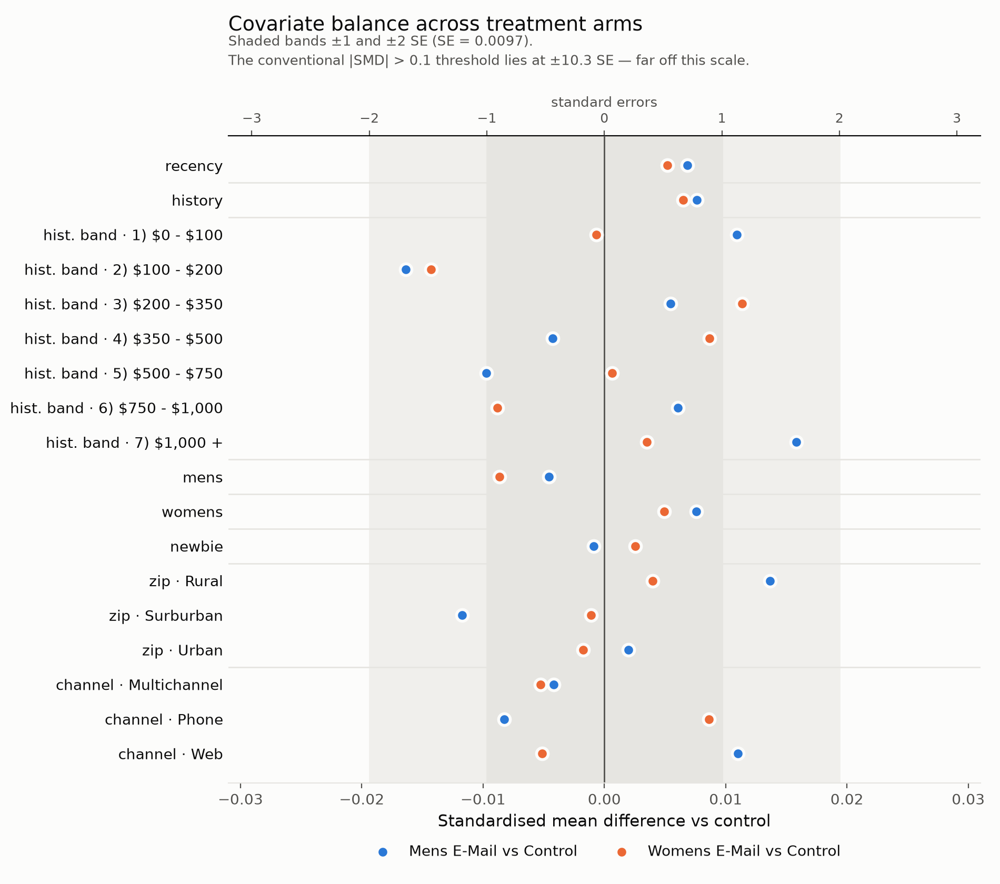

# Email Campaign Experiment Analysis

End-to-end analysis of a three-arm randomised marketing experiment: 64,000 customers
assigned to a Mens e-mail, a Womens e-mail, or no e-mail, with outcomes measured over
the following two weeks.

The point of this repository is **process discipline**, not the size of the effect it
finds. The primary metric, the estimator for every metric, the subgroups, the
multiplicity correction, and the decision rule were all fixed in
[`PRE_REGISTRATION.md`](PRE_REGISTRATION.md) and committed **before any outcome was
computed by treatment arm**. The git history is the evidence.

> **Status: in progress.** Phases 0–3 are complete: setup, pre-registration, data quality,
> and randomisation checks. **No treatment effect has been computed yet** — every result
> below is either pooled across arms or restricted to pre-treatment covariates. The
> primary analysis is Phase 4.

---

## Analysis integrity rules

These are constraints on how this repository may be developed, not aspirations:

1. **`PRE_REGISTRATION.md` is committed and pushed before any outcome-by-arm code
   exists.** It is tagged `pre-registration-v1`. Verify with
   `git log --format='%h %ad %s' --date=iso`.
2. **History is never rewritten.** No rebase, squash, amend, or force-push after the
   pre-registration commit. A tidied history would destroy the evidence it exists to
   provide.
3. **Changes of plan are amendments**, appended as new sections in new commits. The
   original text is never edited.
4. **Pooled statistics only, before the gate.** Anything computed prior to the
   pre-registration is pooled across all three arms and therefore reveals no treatment
   contrast. See the header of [`sql/03_sanity_checks.sql`](sql/03_sanity_checks.sql).

---

## Data

[Hillstrom MineThatData E-Mail Analytics Challenge](http://www.minethatdata.com/Kevin_Hillstrom_MineThatData_E-MailAnalytics_DataMiningChallenge_2008.03.20.csv)
(2008). 64,000 customers who had purchased in the prior twelve months, randomised
roughly evenly across three arms.

| Group | Columns |
|---|---|
| Assignment | `segment` |
| Pre-treatment | `recency`, `history`, `history_segment`, `mens`, `womens`, `zip_code`, `newbie`, `channel` |
| Outcomes (2 weeks post) | `visit`, `conversion`, `spend` |

`history` is prior-year spend and `spend` is post-period spend — the same quantity
measured before and after treatment, which is what makes CUPED applicable here on real
data rather than a synthetic example.

The CSV is downloaded at build time into a gitignored `data/` directory and is not
committed.

---

## Data Quality

All checks in [`sql/03_sanity_checks.sql`](sql/03_sanity_checks.sql). Every query is
pooled across arms, so running them revealed no treatment contrast.

| Check | Result |
|---|---|
| Row count | 64,000 exactly |
| Nulls | zero, every column |
| Funnel consistency | `spend > 0 ⟹ conversion = 1 ⟹ visit = 1`, **zero violations** |
| `history` vs `history_segment` | coherent across all seven bands, no overlaps |
| Duplicate covariate vectors | 1,072 groups — **coincidence, not a defect** (below) |
| `mens = 0 AND womens = 0` | **never occurs** |
| Purchasers | 578 of 64,000 (**0.90%**) |
| Spend concentration | top 50 customers = **29.4%** of total spend |
| `spend` 99th percentile | **$0.00** |

Four of these changed the analysis plan rather than merely describing the data.

**The 99th percentile of `spend` is $0.00.** With only 0.90% of customers spending
anything, the textbook "winsorise at p99" rule is degenerate here — applying it would
cap every purchaser at zero and silently delete the metric. The pre-registered rule is
the 99.9th percentile (**$243.66**, capping 64 customers) instead. This was caught before
the pre-registration was written, which is the only reason it is a design choice rather
than a bug.

**`mens = 0 AND womens = 0` never occurs.** Every customer bought mens or womens
merchandise in the prior year, so the prior-purchase targeting variable has **three**
cells, not four: mens-only (28,818), womens-only (28,734), both (6,448). The small
"both" cell is why that subgroup carries an MDE of 0.81 pp, roughly three times the
overall test.

**The 1,072 duplicate groups are coincidence.** Exact duplicates across all twelve
columns sound alarming, so they were tested rather than assumed. A duplicated export or
a botched load copies a record *together with its assignment*, so its copies land in the
same arm. Two genuinely different customers who happen to share a covariate vector were
randomised independently, so a duplicate pair should share an arm about a third of the
time. Observed: **0.3077** across 143 pairs, against 0.3333 predicted by coincidence — and
far from the ~1.0 a duplication defect would produce. With 34,833 distinct `history`
values across 64,000 rows and 85% of customers having all-zero outcomes, collisions are
expected.

**One claim in the project brief did not survive checking.** It states that roughly 50
customers account for over half the incremental spend. For *total* spend the top 50 are
**29.4%**. These are different quantities, so the claim is not necessarily wrong — but it
is unverified, and it is not repeated here. It will be revisited when incremental spend
becomes computable in Phase 4.

---

## Randomisation Checks

Full narrative in
[`notebooks/02_randomization_checks.ipynb`](notebooks/02_randomization_checks.ipynb);
logic in [`src/balance.py`](src/balance.py).

Both checks read pre-treatment covariates and assignment counts only, so randomisation
was verified **before any treatment effect was computed** — not merely before it was
reported.

**Sample ratio mismatch: none.** χ²(2) = 0.20, **p = 0.90** against an equal three-way
split (21,307 / 21,306 / 21,387; largest deviation 54 customers, 0.25%). Had this failed,
the correct response would have been to stop and investigate the assignment mechanism —
*not* to adjust for the imbalance. Whatever corrupts assignment may equally have
corrupted the outcomes, and no covariate adjustment repairs that.

**Covariate balance: clean.** Eight pre-treatment covariates expand to 18 rows across two
contrasts — 36 comparisons. Zero exceeded |SMD| > 0.10; the largest was 0.0164.

<picture>
  <source media="(prefers-color-scheme: dark)" srcset="figures/covariate_balance-dark.png">
  
</picture>

### Reading the balance table correctly

"Zero covariates exceeded 0.10" is **not** the finding, and reporting it as one would be
misleading. For two arms of size *n*, SE(SMD) ≈ √(2/n). At n ≈ 21,300 that is **0.0097**,
so the conventional 0.10 threshold sits **10.3 standard errors** away — it could not
realistically fire regardless of how the randomiser behaved. That rule of thumb comes
from observational studies and small trials, where imbalance genuinely lives on that
scale; it does not transfer to a 64,000-person randomised experiment.

The check with actual teeth is whether the SMDs scatter like noise of the predicted size:

| | |
|---|---|
| SE(SMD) predicted by randomisation | 0.0097 |
| Observed SD of the 36 SMDs | 0.0081 (**0.84×** predicted) |
| Largest \|SMD\|, in SE units | 1.69 SE |

The slight shortfall below 1.00× is expected: one-hot levels within a categorical sum to
one, so their SMDs are negatively correlated and the 36 comparisons are not independent
draws.

Two further notes on interpretation:

- **Balance p-values are not the evidence.** Under true randomisation the null of balance
  is *known* to be true, so a balance test is not testing a hypothesis — with enough rows
  any trivial difference becomes "significant." SMDs are reported as primary for that
  reason.
- **A single imbalanced covariate would not have meant failure.** Across 36 comparisons
  roughly 1.8 nominally significant results are expected by chance (observed: 0). Reading
  one flagged row as a broken randomiser is a common error; the reasoning matters even
  though the question is moot here.

Balance being confirmed is also what licenses the covariate adjustment pre-registered in
§5: the Lin estimator is buying precision, not silently patching a compositional
difference between arms.

---

## Setup

Requires Docker and Python 3.12+.

```bash
git clone https://github.com/Aarnavg04/email-campaign-experiment-analysis.git
cd email-campaign-experiment-analysis

cp .env.example .env

python -m venv .venv
source .venv/bin/activate
pip install -r requirements.txt

docker compose up -d          # PostgreSQL 16 on host port 5433
python -m src.db              # download, create schema, load, verify 64,000 rows
```

`src.db` exits non-zero unless exactly 64,000 rows land across exactly three arms, so a
silent partial load cannot pass unnoticed.

**Why port 5433 and not 5432?** The machine this was developed on runs an unrelated
PostgreSQL instance on 5432. Binding the default port risked a stale connection string
silently loading data into the wrong server while appearing to succeed. 5433 works on a
clean machine too, so there is no reason to change it.

Reproduce the analysis:

```bash
psql -h localhost -p 5433 -U hillstrom -d hillstrom -f sql/03_sanity_checks.sql
python -m src.power       # MDEs; asserts they match PRE_REGISTRATION.md §8
python -m src.balance     # SRM test and covariate balance
python -m src.plots       # regenerates figures/
```

To run the notebook, register the environment as a kernel first:

```bash
python -m ipykernel install --user --name hillstrom --display-name "Python (hillstrom)"
jupyter lab notebooks/02_randomization_checks.ipynb
```

---

## Repository layout

```
├── PRE_REGISTRATION.md      the gate: metrics, estimators, subgroups, decision rule
├── docker-compose.yml       PostgreSQL 16, host port 5433
├── sql/
│   ├── 01_schema.sql        customers table, CHECK constraints, indexes
│   ├── 03_sanity_checks.sql pooled data-quality checks (no outcome-by-arm)
│   └── 04_covariate_balance.sql  per-arm moments, pre-treatment covariates only
├── src/
│   ├── db.py                download, schema, load, verification
│   ├── power.py             MDEs; verifies it reproduces PRE_REGISTRATION.md §8
│   ├── balance.py           SRM chi-square, SMDs, noise calibration
│   └── plots.py             figures, light and dark variants
├── notebooks/
│   └── 02_randomization_checks.ipynb
└── figures/
```

---

## Stack

PostgreSQL for the metric layer (schema, aggregation, window functions); Python for
inference (power, bootstrap, regression adjustment, CUPED, multiplicity correction).
Aggregations happen in SQL, inference in Python.

**On scale:** 64,000 rows is not big data. This layer demonstrates schema design,
constraint discipline, and correct aggregation — nothing about distributed processing,
and the repository does not claim otherwise.
